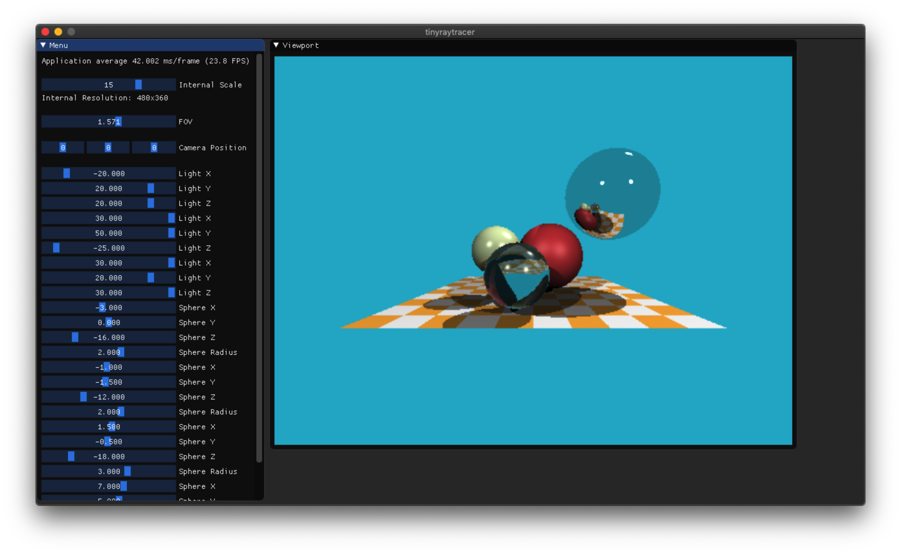

# tinyraytracer-interactive
_tinyraytracer, but rendering to the screen in realtime_

## Original
https://github.com/ssloy/tinyraytracer

## Points of Interest
Instead of writing the results of the raytracing out to a `.ppm` file like in the original, the framebuffer data is pushed into an OpenGL texture: 
`glTexImage2D(GL_TEXTURE_2D, 0, GL_RGB, width, height, 0, GL_RGB, GL_FLOAT, data);`, this is easily presented by imgui: `ImGui::Image((ImTextureID)texture_id, ImVec2(width, height));`.

For clarity, and in order to keep the focus on ssloy's raytracing code, I've kept unrelated code away from `tinyraytracer.cpp`.

At the cost of an increased build time, all dependencies are built from source and statically linked to the final binary.

## Build
```
git clone --recurse-submodules https://github.com/zach2good/tinyraytracer-interactive.git
cd tinyraytracer-interactive
mkdir build
cd build
cmake ..
make
```

## Tested On
```
macOS Mojave 10.14 - Apple LLVM version 10.0.0 (clang-1000.11.45.5)
macOS Mojave 10.14 - clang version 6.0.1 (tags/RELEASE_601/final)
```
## Screenshot


